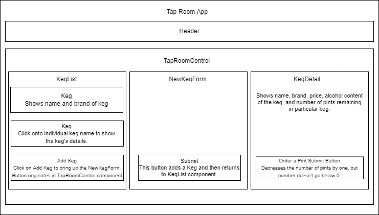

# Tap Room

####  Tap Rooom is an application where a user can keep track of their inventory of kegs. The main page lists all kegs in the inventory along with a button that opens a form to add kegs to the inventory. A user should be able to view the name, brand, price, and alcohol content for each keg listed on each kegs detail page after clicking on the name of the individual keg. Also, on the detail page is a button to order a pint of that particular beer and which decrements the amount of pints left after the order is submitted.

#### **By Shane Graff**

#### Table of Contents

1. [Technologies Used](#technologies)
2. [Setup/Installation Requirements](#setup)
3. [App Layout](#layout)
4. [Known Bugs](#bugs)
5. [License](#license)
6. [Contact Information](#contact)
7. [More Info on REACT/Boilerplate](#react)

## Technologies Used <a id="technologies"></a>

* JavaScript
* [JSX](https://reactjs.org/docs/introducing-jsx.html) 
* [REACT Framework](https://reactjs.org)

## Setup/Installation Requirements <a id="setup"></a>

1. [Make sure you have Node.js installed](https://nodejs.org/en/download/)
2. Run the following command: ```git clone https://github.com/ShanGGraff/tap-room``` in a directory of your choice.
3. Navigate to the ```tap-room/``` directory and run ```npm install```.
4. Next run ```npm run build```.
5. Once all the packages have been downloaded and installed, run ```npm start```. This will start a local server and open a tab on your browser where you can use the application.

## Tap Room Layout<a id="layout"></a>



## Known Bugs <a id="bugs"></a>
* TBD

## License
* [MIT](https://choosealicense.com/licenses/mit/)

Copyright (c) 2021 Creators 

## Contact Information <a id="contact"></a>

* Shane Graff <copellius@gmail.com>
* Github page: [ShanGGraff](https://github.com/ShanGGraff)
* LinkedIn: [Shane Graff](https://www.linkedin.com/in/shanegraff)

-----------------------------------------------------------------

# Getting Started with Create React App <a id="react"></a>

This project was bootstrapped with [Create React App](https://github.com/facebook/create-react-app).

## Available Scripts

In the project directory, you can run:

### `npm start`

Runs the app in the development mode.\
Open [http://localhost:3000](http://localhost:3000) to view it in your browser.

The page will reload when you make changes.\
You may also see any lint errors in the console.

### `npm test`

Launches the test runner in the interactive watch mode.\
See the section about [running tests](https://facebook.github.io/create-react-app/docs/running-tests) for more information.

### `npm run build`

Builds the app for production to the `build` folder.\
It correctly bundles React in production mode and optimizes the build for the best performance.

The build is minified and the filenames include the hashes.\
Your app is ready to be deployed!

See the section about [deployment](https://facebook.github.io/create-react-app/docs/deployment) for more information.

### `npm run eject`

**Note: this is a one-way operation. Once you `eject`, you can't go back!**

If you aren't satisfied with the build tool and configuration choices, you can `eject` at any time. This command will remove the single build dependency from your project.

Instead, it will copy all the configuration files and the transitive dependencies (webpack, Babel, ESLint, etc) right into your project so you have full control over them. All of the commands except `eject` will still work, but they will point to the copied scripts so you can tweak them. At this point you're on your own.

You don't have to ever use `eject`. The curated feature set is suitable for small and middle deployments, and you shouldn't feel obligated to use this feature. However we understand that this tool wouldn't be useful if you couldn't customize it when you are ready for it.

## Learn More

You can learn more in the [Create React App documentation](https://facebook.github.io/create-react-app/docs/getting-started).

To learn React, check out the [React documentation](https://reactjs.org/).

### Code Splitting

This section has moved here: [https://facebook.github.io/create-react-app/docs/code-splitting](https://facebook.github.io/create-react-app/docs/code-splitting)

### Analyzing the Bundle Size

This section has moved here: [https://facebook.github.io/create-react-app/docs/analyzing-the-bundle-size](https://facebook.github.io/create-react-app/docs/analyzing-the-bundle-size)

### Making a Progressive Web App

This section has moved here: [https://facebook.github.io/create-react-app/docs/making-a-progressive-web-app](https://facebook.github.io/create-react-app/docs/making-a-progressive-web-app)

### Advanced Configuration

This section has moved here: [https://facebook.github.io/create-react-app/docs/advanced-configuration](https://facebook.github.io/create-react-app/docs/advanced-configuration)

### Deployment

This section has moved here: [https://facebook.github.io/create-react-app/docs/deployment](https://facebook.github.io/create-react-app/docs/deployment)

### `npm run build` fails to minify

This section has moved here: [https://facebook.github.io/create-react-app/docs/troubleshooting#npm-run-build-fails-to-minify](https://facebook.github.io/create-react-app/docs/troubleshooting#npm-run-build-fails-to-minify)